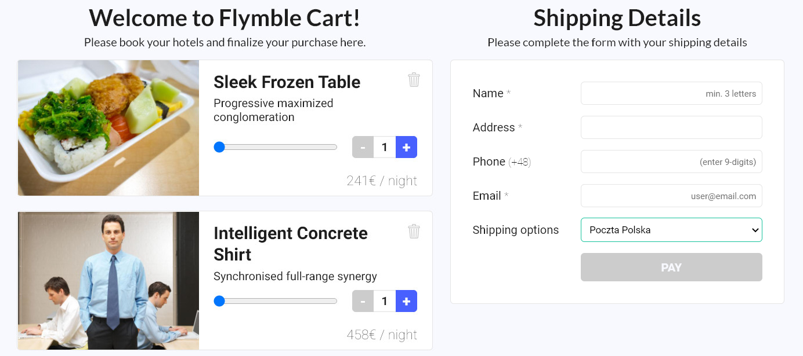

# Flymble React Developer Task
> by [Ahmet Alper](https://github.com/ahmetalpergit)

# 

## API

MockAPI using the url: https://604fca60c20143001744dc61.mockapi.io/hotels

## How to run

Just visit the link and test the deployed version out: https://task-flymble.netlify.app/

### Extra/Optinal Tasks

- HTTP check ✔
- Loading Skeleton ✔
- Slider input ✔